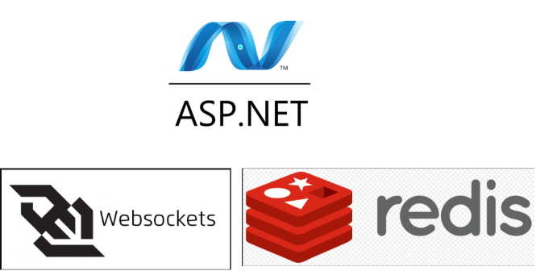
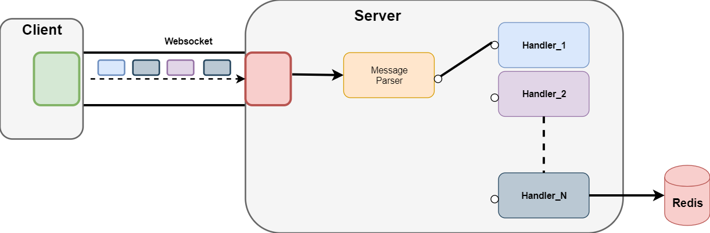

<div style="page-break-after: always"></div>

# Writing a Chat Application from scratch featuring ASP NET 5.0 , Redis Pub/Sub and Websockets



<div style="page-break-after: always"></div>

## Introduction

This will be a multi-part series in which we are going to build from scratch a **Chat application** . In this article we are going to build the chat server which is the backbone of the chat application.

Supported Features:

- subscription to one or multiple channels
- unsubscription from target/all channels
- sending messages to target channel
- receiving messages from all subscribed channels

### Motivation

Ever since i started playing online games in middle-school back in 2003 (Warcraft 3) , i have been using messaging applications in order to communicate with my peers. The first such application  which in time became ubiquitous was Skype.

Years after completely abandoning gaming and dabbling for some time in areas such as Industrial Automation , Embedded Devices i rediscovered my passion for chat apps , but this time i was poised to create them.

<div style="page-break-after: always"></div>

## Architecture

### System Overview


- **Server**:  ASP NET Core Web application - the server where our logic will run handling client operations (subscribe/unsubscribe/publish message/get channels)
- **Database** : Redis as a message broker with its publish/subscribe functionality and also for storage (user subscribed channels)
- **Client Communication Protocol** : Since this is a chat application (bidirectional communication required) ,  the protocol we will be using is **Websockets**.

<div style="page-break-after: always"></div>

### Flow

By flow we will be referring to the way both inbound- messages arriving from the client  and outbound messages  sent to the client are handled and where and how does the Websocket object fit in as well as the Redis database.

#### Inbound Task



The inbound [Task](https://docs.microsoft.com/en-us/dotnet/api/system.threading.tasks.task?view=net-5.0)  is basically a loop which receives messages from the client , parses them and dispatches them to an appropriate handler as can be seen from above.

**Note**: One such handler will write messages to a redis **channel**.

<div style="page-break-after: always"></div>

#### Outbound Task


The outbound task is  started asynchronously from the  inbound task.

##### The Outbound Queue

The outbound queue acts as a sink for all producers as can be seen from the picture. In our case the producers are:

- **Inbound Task**: The messages that the server sends back to the client (messages of type SERVER_RESULT)
- **Redis**:  All messages that are published on channels on which our user is subscribed to.

As long as there are messages available in the queue we pop them  and send them to the client over the websocket connection.

When there are no messages inside the queue, the task blocks , awaiting new ones.

<div style="page-break-after: always"></div>

## Prerequisites

Those familiar with setting up /using Redis and  .NET can skip this section.

#### Installing Redis

For this solution you will need to install Redis Server . You can download it from [here](https://redis.io/download).

For windows users (me included) the easiest way to install redis is via the package manager *chocolatey* from  [here](https://chocolatey.org/install) . Once installed  from a terminal just run:

`> choco redis`

If the install was successful from a terminal run

`> redis-server`

and you should see the below output which indicates your redis server is up and running.


<div style="page-break-after: always"></div>

##### Using Redis-Cli

With the `redis-server` started  you can start playing with redis using the `Redis-Cli` from a terminal with the command`redis-cli`.


You can also test the `publish-subscribe` feature of redis by opening two  `redis-cli`  like below:


`redis-cli` can be used as a debugging/diagnosis tool , especially in our pubslish-subscribe scenario where you can easily hook up to a target channel and see if your messages get published/delivered.

#### NET 5.0

For this application we are using .NET 5.0 and you can download it from  [here](https://dotnet.microsoft.com/download/dotnet/5.0).

<div style="page-break-after: always"></div>

## Implementation

### Source Code

We will be starting our project from a template of type `ASP NET Core Web Application`.

#### Main

```cs

 /// The entrypoint in our application
 public class Program {
        public static void Main(string[] args) {
            CreateWebHostBuilder(args).Build().Run();
        }

        public static IWebHostBuilder CreateWebHostBuilder(string[] args) {
            var webhostbuilder = WebHost.CreateDefaultBuilder(args)
                .UseUrls(Constants.SERVER_URL)  
                .UseStartup<Startup>();
            return webhostbuilder;
        }
    }
````

```cs
 /// Called above by extension method `UseStartup`
 /// Constants.REDIS_CONNECTION is a plain string , eg: localhost:6379  (6379 is the default redis port)

 public class Startup {

        public IConfiguration Configuration { get; }

        public Startup(IConfiguration configuration) {
            Configuration = configuration;
        }  
        public void ConfigureServices(IServiceCollection services) {
            services.AddControllers();
            ConnectionMultiplexer mux = ConnectionMultiplexer.Connect(Constants.REDIS_CONNECTION);
            services.AddSingleton(mux);
        }
        public void Configure(IApplicationBuilder app) {
            app.UseRouting();
            app.UseWebSockets();
            app.MapWhen(y => y.WebSockets.IsWebSocketRequest, a => a.UseMiddleware<SocketWare>());
        }
    }
````

The above sections are mandatory in any `ASP NET Core` application. The `Program.Main` starts the application and will  use the `Startup` class to configure it.

The `ConnectionMultiplexer` is our connection to the redis database and will be injected as a singleton resource in our application. Connected clients will use the multiplexer as a factory for subscriptions to target channels.

#### Middleware

In the `Startup` class  `Configure` method above notice the `MapWhen`extension . Based on a predicate it will route  all  requests to the  specified [ASP NET Core Middleware](https://docs.microsoft.com/en-us/aspnet/core/fundamentals/middleware/?view=aspnetcore-5.0).

In our case:

- predicate = request should be of type websocket
- middleware is of type `SocketWare` (presented below)

```cs
public class SocketWare {
        private RequestDelegate next;
        private ConnectionMultiplexer mux;
        public SocketWare(RequestDelegate _next, ConnectionMultiplexer mux) {
            this.next = _next;
            this.mux = mux;
        }

        ///Called by the framework on each websocket request
        public async Task Invoke(HttpContext context) {
            using (var socket = await context.WebSockets.AcceptWebSocketAsync()) {
                ChatClient client = new ChatClient(this.mux);
                await client.RunAsync(socket);
            }
        }
    }
```

The `ConnectionMultiplexer` is passed using dependency injection  - remember it was injected in the `Startu.ConfigureServices` method !

The `Invoke` method  is a minimal requirement for any ASP NET middleware so that the framework knows to route the incoming request , and lets you handle it.

<div style="page-break-after: always"></div>

#### Core

This is the core of the application and since it is the most complex part i will post the entire component , and will explain it afterwards.

##### State

The core component uses a private field of type `State` for its operations.

```cs
   internal class State {
        public string ClientId { get; set; }
        public Task outboundTask;
        public ISubscriber subscriber;
        public IDatabase redisDB;
    }
```

- `ISubscriber`is a component of [StackExchangeRedis](https://github.com/StackExchange/StackExchange.Redis)  and  is used to subscribe/unsubscribe on redis channels. In doing so we need to provide in both operations the handler which is`OnRedisMessageHandler`.
- `IDatabase` is a also a  component of [StackExchangeRedis](https://github.com/StackExchange/StackExchange.Redis) and is used for all redis commands.In our case , for each client we will store in redis a hashset containing the subscribed channels.All CRUD operations over the hashset will be done using this variable.
- `outboundTask` - the task that runs the outbound flow ( taking messages from the queue and pushing them over the websocket)

##### Chat Client

```cs
 public sealed partial class ChatClient {

        private const int BUFFER_SIZE = 1024;
        private State state = new State();
        private BlockingCollection<string> outboundQueue = new BlockingCollection<string>();
  
        private Action<RedisChannel, RedisValue> onRedisMessageHandler = null;
        public Action<RedisChannel, RedisValue> OnRedisMessageHandler {
            get {
                if (this.onRedisMessageHandler == null) {
                    this.onRedisMessageHandler = new Action<RedisChannel, RedisValue>((channel, value)  => this.outboundQueue.Add(value));
                }
                return this.onRedisMessageHandler;
            }
        }  


        //Constructor -receives the multiplexer
        public ChatClient(ConnectionMultiplexer mux) {
            this.state.subscriber = mux.GetSubscriber();
            this.state.redisDB = mux.GetDatabase();
        }


        //entrypoint -starts asynchronous outbound task
        public async Task RunAsync(WebSocket socket) {
            this.state.outboundTask = Task.Run(async () => {
                foreach (var item in this.outboundQueue.GetConsumingEnumerable()) {
                    var bytes = Encoding.UTF8.GetBytes(item);
                    await socket.SendAsync(bytes,WebSocketMessageType.Text,true,CancellationToken.None);
                }
            });
            await this.InboundLoopAsync(socket);
        }
  


        // inbound task - receives messages ,parses them and handles them accordingly
        // on loop end - triggers the cleanup routine
        private async Task InboundLoopAsync(WebSocket socket) {

            byte[] inboundBuffer = ArrayPool<byte>.Shared.Rent(BUFFER_SIZE);   
            try {
                while (true) {
                    WebSocketReceiveResult wsResult = await socket.ReceiveAsync(inboundBuffer,CancellationToken.None);
                    if (wsResult.MessageType == WebSocketMessageType.Close) {
                        ArrayPool<byte>.Shared.Return(inboundBuffer);
                        return;
                    }
                    byte[] incomingBytes = inboundBuffer[0..wsResult.Count]; 
                    WSMessage message = JsonSerializer.Deserialize<WSMessage>(Encoding.UTF8.GetString(incomingBytes));
                    await this.HandleMessageAsync(message); //check next section !
                }
            } finally {
                await this.CleanupSessionAsync();
            }
        }

       // cleanup routine
       //cleans redis hashset containing subscribed channels && subscriptions to said channels
        private async Task CleanupSessionAsync() {
            foreach (var channelHash in await this.state.redisDB.HashGetAllAsync(this.state.ClientId)) {
                await this.state.subscriber.UnsubscribeAsync(channelHash.Name.ToString(), this.OnRedisMessageHandler);
            }
            await this.state.redisDB.KeyDeleteAsync(this.state.ClientId);
        }

    }
````

<div style="page-break-after: always"></div>

###### Chat Client Handlers

We have defined the `ChatClient` as `partial` in order to separate the message handling method `HandleMessageAsync` from the rest of the class due to its complexity.

This method is just a large `switch-case` statement where we either :

- edit the Redis hashset holding subscribed user channels  , and forward the result of the operation  to the `outboundQueue` to get popped in the `outboundTask`at some point , and , eventually get written over the websocket to the client.
- publish the incoming message to the redis channel , thus all other subscribed users will receive it.

<div style="page-break-after: always"></div>

## Testing

I  will be using [Simple WebSocket Client](https://chrome.google.com/webstore/detail/simple-websocket-client/pfdhoblngboilpfeibdedpjgfnlcodoo)  as a testing interface.

### Subscribe and Unsubscribe


In the picture above in the  **Message Log**

- The red line(s) are messages we send to the server
- The black line(s) are server sent messages


### Message

Now that you are comfortable with the [Simple WebSocket Client](https://chrome.google.com/webstore/detail/simple-websocket-client/pfdhoblngboilpfeibdedpjgfnlcodoo) we can try sending messages to ourselves like below:


We subscribe to channel `mychannel`, we send some messages and then unsubscribe. As expected the last message will not get published since we unsubscribed from the target channel.
