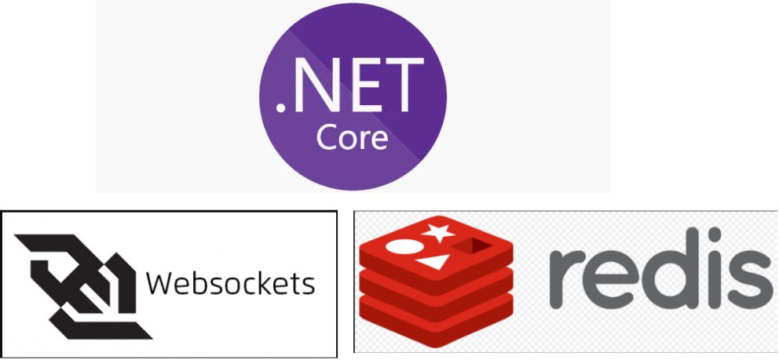
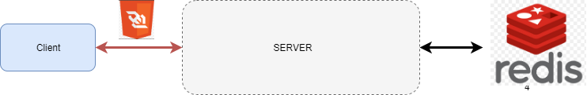
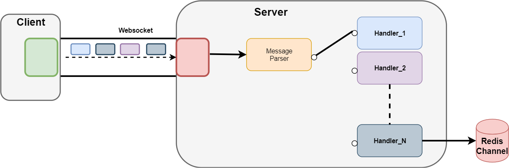
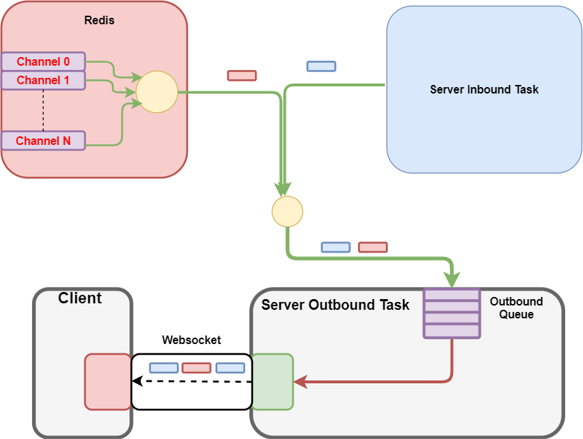
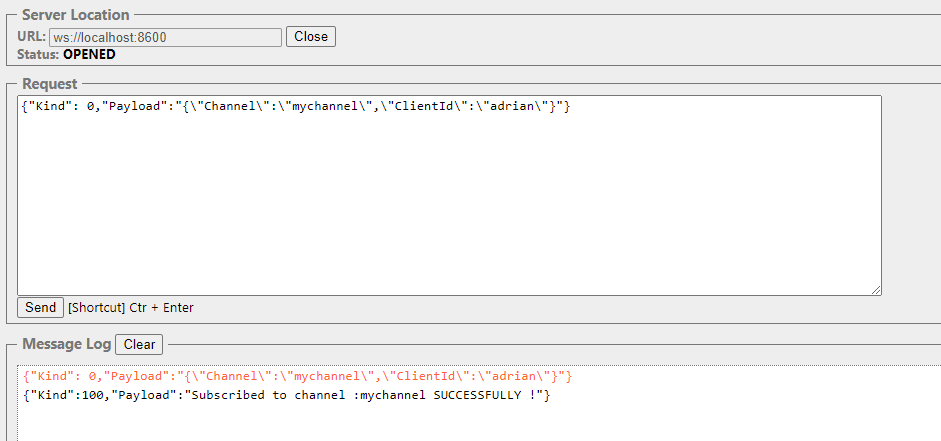
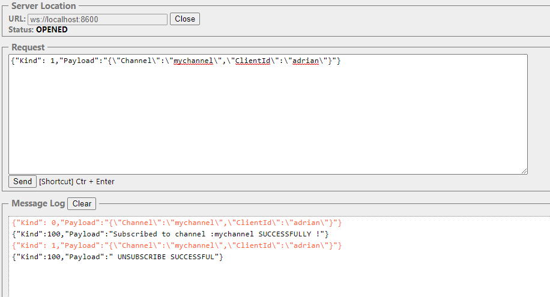
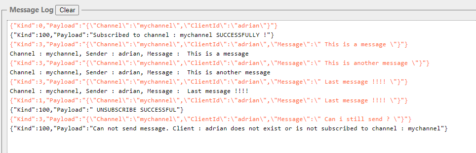

<div style="page-break-after: always"></div>

# Ctesiphon



<div style="page-break-after: always"></div>

## Introduction

This will be a multi-part series in which we are going to build from scratch a **Chat application** . In this article we are going to build the chat server which is the backbone of the chat application.

Supported Features:

- subscription to one or multiple channels
- unsubscription from target/all channels
- sending messages to target channel
- receiving messages from all subscribed channels

### Motivation

Ever since i started playing online games in middle-school back in 2003 (Warcraft 3) , i have been using messaging applications in order to communicate with my peers. The first such application  which in time became ubiquitous was Skype.

Years after completely abandoning gaming and dabbling for some time in areas such as Industrial Automation , Embedded Devices i rediscovered my passion for messaging apps , but this time i was poised to create them.

<div style="page-break-after: always"></div>

## Architecture

### System Overview



- **Server**:  ASP NET Core Web application - the server where our logic will run handling client operations (subscribe/unsubscribe/publish message/get channels)
- **Database** : Redis as a message broker with its publish/subscribe functionality and also for storage (user subscribed channels)
- **Client Communication Protocol** : Since this is a chat application (bidirectional communication required) ,  the protocol we will be using is **Websockets**.

<div style="page-break-after: always"></div>

### Flow

By flow we will be referring to the way both inbound- messages arriving from the client  and outbound messages  sent to the client are handled and where and how does the Websocket object fit in as well as the Redis database.

#### Inbound Task



The inbound [Task](https://docs.microsoft.com/en-us/dotnet/api/system.threading.tasks.task?view=net-5.0)  is basically a loop which receives messages from the client , parses them and dispatches them to an appropriate handler as can be seen from above.

**Note**: One such handler will write messages to a redis **channel**.

<div style="page-break-after: always"></div>

#### Outbound Task



The outbound Task is a loop started asynchronously from the  inbound task.Its purpose is to pop items off the queue and write them over the websocket to the connected client.

##### The Outbound Queue

The outbound queue acts as a sink for all producers as can be seen from the picture. In our case the producers are:

- **Inbound Task**: The messages that the server sends back to the client (messages of type SERVER_RESULT)
- **Redis**:  All messages that are published on channels on which our user is subscribed to.

As long as there are messages available in the queue we pop them  and send them to the client over the websocket connection.

When there are no messages inside the queue, the task blocks , awaiting new ones.<div style="page-break-after: always"></div>

## Implementation & Source Code

We will be starting our project from a template of type `ASP NET Core Web Application`.

#### Main

```cs

 /// The entrypoint in our application
 public class Program {
        public static void Main(string[] args) {
            CreateWebHostBuilder(args).Build().Run();
        }

        public static IWebHostBuilder CreateWebHostBuilder(string[] args) {
            var webhostbuilder = WebHost.CreateDefaultBuilder(args)
                .UseUrls(Constants.SERVER_URL)  
                .UseStartup<Startup>();
            return webhostbuilder;
        }
    }
````

```cs
 /// Called above by extension method `UseStartup`
 /// Constants.REDIS_CONNECTION is a plain string , eg: localhost:6379  (6379 is the default redis port)

 public class Startup {

        public IConfiguration Configuration { get; }

        public Startup(IConfiguration configuration) {
            Configuration = configuration;
        }  
        public void ConfigureServices(IServiceCollection services) {
            services.AddControllers();
            ConnectionMultiplexer mux = ConnectionMultiplexer.Connect(Constants.REDIS_CONNECTION);
            services.AddSingleton(mux);
        }
        public void Configure(IApplicationBuilder app) {
            app.UseRouting();
            app.UseWebSockets();
            app.MapWhen(y => y.WebSockets.IsWebSocketRequest, a => a.UseMiddleware<SocketWare>());
        }
    }
````

The above sections are mandatory in any `ASP NET Core` application and are automatically generated from the template .

The `Program.Main` starts the application and will  use the `Startup` class to configure it.

In the `Startup.ConfigureServices` , the `ConnectionMultiplexer` is our connection to the redis database and will be injected as a singleton resource in our application. Connected clients will use the multiplexer as a factory for subscriptions to target channels.

#### Middleware

In the `Startup` class  `Configure` method above , notice the `MapWhen`extension . Based on a predicate it will route  all  requests to the  specified [ASP NET Core Middleware](https://docs.microsoft.com/en-us/aspnet/core/fundamentals/middleware/?view=aspnetcore-5.0).

In our case:

- predicate = request should be of type websocket
- middleware is of type `SocketWare` (presented below)

```cs
public class SocketWare {
        private RequestDelegate next;
        private ConnectionMultiplexer mux;
        public SocketWare(RequestDelegate _next, ConnectionMultiplexer mux) {
            this.next = _next;
            this.mux = mux;
        }

        ///Called by the framework on each websocket request
        public async Task Invoke(HttpContext context) {
            using (var socket = await context.WebSockets.AcceptWebSocketAsync()) {
                ChatClient client = new ChatClient(this.mux);
                await client.RunAsync(socket);
            }
        }
    }
```

The `ConnectionMultiplexer` is passed using dependency injection  - remember it was injected in the `Startu.ConfigureServices` method !

The `Invoke` method  is a minimal requirement for any [ASP NET Core Middleware](https://docs.microsoft.com/en-us/aspnet/core/fundamentals/middleware/?view=aspnetcore-5.0) so that the framework knows to route the incoming request , and lets you handle it.

<div style="page-break-after: always"></div>

#### Core

This is the core of the application and since it is the most complex part i will post the entire component , and will explain it afterwards.

##### State

The core component uses a private field of type [State](https://github.com/sanzor/Ctesiphon/blob/master/Core/State.cs) for its operations.

```cs
   internal class State {
        public string ClientId { get; set; }
        public Task outboundTask;
        public ISubscriber subscriber;
        public IDatabase redisDB;
    }
```

- `ISubscriber`is a component of [StackExchangeRedis](https://github.com/StackExchange/StackExchange.Redis)  and  is used to subscribe/unsubscribe on redis channels.
- `IDatabase` is a also a  component of [StackExchangeRedis](https://github.com/StackExchange/StackExchange.Redis) and is used for issuing redis querries.
- `outboundTask` - the task that runs the outbound flow ( taking messages from the queue and pushing them over the websocket)

##### Chat Client

```cs
 public sealed partial class ChatClient {

        private const int BUFFER_SIZE = 1024;
        private State state = new State();
        private BlockingCollection<string> outboundQueue = new BlockingCollection<string>();
  
        private Action<RedisChannel, RedisValue> onRedisMessageHandler = null;
        public Action<RedisChannel, RedisValue> OnRedisMessageHandler {
            get {
                if (this.onRedisMessageHandler == null) {
                    this.onRedisMessageHandler = new Action<RedisChannel, RedisValue>((channel, value)  => this.outboundQueue.Add(value));
                }
                return this.onRedisMessageHandler;
            }
        }  


        //Constructor -receives the multiplexer
        public ChatClient(ConnectionMultiplexer mux) {
            this.state.subscriber = mux.GetSubscriber();
            this.state.redisDB = mux.GetDatabase();
        }
  
        public async Task RunAsync(WebSocket socket) {
            this.state.outboundTask = Task.Run(async()=>await OutboundLoopAsync(socket));
            await this.InboundLoopAsync(socket);
        }
  
        public async Task OutboundLoopAsync(WebSocket socket){
           foreach (var item in this.outboundQueue.GetConsumingEnumerable()) {
                    var bytes = Encoding.UTF8.GetBytes(item);
                    await socket.SendAsync(bytes,WebSocketMessageType.Text,true,CancellationToken.None);
            }
        }

        private async Task InboundLoopAsync(WebSocket socket) {

            byte[] inboundBuffer = ArrayPool<byte>.Shared.Rent(BUFFER_SIZE);   
            try {
                while (true) {
                    WebSocketReceiveResult wsResult = await socket.ReceiveAsync(inboundBuffer,CancellationToken.None);
                    if (wsResult.MessageType == WebSocketMessageType.Close) {
                        ArrayPool<byte>.Shared.Return(inboundBuffer);
                        return;
                    }
                    byte[] incomingBytes = inboundBuffer[0..wsResult.Count]; 
                    WSMessage message = JsonSerializer.Deserialize<WSMessage>(Encoding.UTF8.GetString(incomingBytes));
                    await this.HandleMessageAsync(message); //check next section !
                }
            } finally {
                await this.CleanupSessionAsync();
            }
        }

       // cleanup routine
       //cleans redis hashset containing subscribed channels && subscriptions to said channels
        private async Task CleanupSessionAsync() {
            foreach (var channelHash in await this.state.redisDB.HashGetAllAsync(this.state.ClientId)) {
                await this.state.subscriber.UnsubscribeAsync(channelHash.Name.ToString(), this.OnRedisMessageHandler);
            }
            await this.state.redisDB.KeyDeleteAsync(this.state.ClientId);
        }

    }
````

The `RunAsync` is the entrypoint to our client ; it starts the asynchronous `outboundTask` and then continues with running the inbound task.

When the `inboundTask` is finished/throws exception , we run the `CleanupSessionAsync` which deletes channel subscriptions as well as client data stored in a redis hashset.

The `OnRedisMessageHandler`   delegate adds new messages to the `outboundQueue` and   is needed to be provided when subscribing/unsubscribing on a target channel.

The `outboundTask` is a long running loop , that  pops messages off the `outboundQueue` or waits in case of none present  (blocking operation)  ; the popped message is then  written over the websocket to the client.

**Note** : To better understand the scope of the two tasks check out the [Sequence Diagram](Docs/Tasks) !

<div style="page-break-after: always"></div>

###### Chat Client Handlers

Now that all I/O operation logic has been written we are going to define the message types and their handlers:

**Message Types**

```cs
public enum DISCRIMINATOR {
            CLIENT__SUBSCRIBE = 0,
            CLIENT_UNSUBSCRIBE = 1,
            CLIENT_MESSAGE = 3,
            CLIENT_GET_CHANNELS=4,
            SERVER__RESULT=100  //server response for a given client request
        }
```

**Note** - All messages that travel over the websocket both inbound and outbound comply to the format of [WSMessage](https://github.com/sanzor/Ctesiphon/blob/master/Core/Models/WSMessage.cs) .

**Dispatcher**

Whenever a new inbound  message arrives  we call the below method.

Depending on the [WSMessage](https://github.com/sanzor/Ctesiphon/blob/master/Core/Models/WSMessage.cs) `Kind` we will deserialize the [WSMessage](https://github.com/sanzor/Ctesiphon/blob/master/Core/Models/WSMessage.cs) `Payload`  in a [Control Message](https://github.com/sanzor/Ctesiphon/blob/master/Core/Models/ControlMessage.cs) or a  [ChatMessage](https://github.com/sanzor/Ctesiphon/blob/master/Core/Models/ChatMessage.cs) .

```cs
 private async Task HandleMessageAsync(WSMessage message) {
            switch (message.Kind) {

                case WSMessage.DISCRIMINATOR.CLIENT__SUBSCRIBE:
                    ControlMessage subscribeMessage = JsonSerializer.Deserialize<ControlMessage>(message.Payload);
                    await this.HandleSubscribeAsync(subscribeMessage);
                    break;
                case WSMessage.DISCRIMINATOR.CLIENT_UNSUBSCRIBE:
                    ControlMessage unsubscribeMessage = JsonSerializer.Deserialize<ControlMessage>(message.Payload);
                    await this.HandleUnsubscribeAsync(unsubscribeMessage);
                    break;
                case WSMessage.DISCRIMINATOR.CLIENT_MESSAGE:
                    ChatMessage chatMessage = JsonSerializer.Deserialize<ChatMessage>(message.Payload);
                    await this.HandleMessageAsync(chatMessage);
                    break;
                case WSMessage.DISCRIMINATOR.CLIENT_GET_CHANNELS:
                    await this.HandleGetChannelsAsync(message);
                    break;
            }
        }
```

Next we are going to see how each message is being treated. The source file cand be found [here](https://github.com/sanzor/Ctesiphon/blob/master/Core/ChatClient.Handlers.cs) as well .

**Susbscribe Handler**

```cs
 private async Task HandleSubscribeAsync(ControlMessage subscribeMessage) {
            WSMessage outboundMessage = null;
            if (subscribeMessage.ClientId != this.state.ClientId && this.state.ClientId != null) {
                outboundMessage = new WSMessage {
                    Kind = WSMessage.DISCRIMINATOR.SERVER__RESULT,
                    Payload = $"Error: ClientId mismatch ! "
                };
                outboundQueue.Add(outboundMessage.ToJson());
                return;
            }
            if (await state.redisDB.HashExistsAsync(this.state.ClientId = subscribeMessage.ClientId, subscribeMessage.Channel)) {
                outboundMessage= new WSMessage {
                    Kind = WSMessage.DISCRIMINATOR.SERVER__RESULT,
                    Payload = $"Error: ALREADY SUBSCRIBED TO CHANNEL {subscribeMessage.Channel}"
                };
                outboundQueue.Add(outboundMessage.ToJson());
                return;
            }
            await this.state.subscriber.SubscribeAsync(subscribeMessage.Channel, this.OnRedisMessageHandler);
            await state.redisDB.HashSetAsync(subscribeMessage.ClientId, subscribeMessage.Channel, "set");
            outboundMessage = new WSMessage {
                Kind = WSMessage.DISCRIMINATOR.SERVER__RESULT,
                Payload = $"Subscribed to channel : {subscribeMessage.Channel} SUCCESSFULLY !"
            };
            outboundQueue.Add(outboundMessage.ToJson());
        }
```

In order for the client to subscribe to a channel  he must provide a `ClientId` as well as a `ChanneId` .

For each client we store in redis an associated hashset of the form :

`{ "client_x" , [ { "channel1":"set" } , {"channel2","set"} , {"channel3","set"} ] }`

We will first test if the `ClientId` matches with the one in redis.If positive we will test if the target `Channel` is already present in the redis hashset.

If all is fine we will use the `SubscribeAsync` method for the target `Channel` providing  the `OnRedisMessageHandler` as the required argument.

On any type of failure we will  write in the `outboundQueue`  a `SERVER_RESULT` type of message with the specific error message.

**Unsubscribe Handler**

```cs
private async Task HandleUnsubscribeAsync(ControlMessage unsubscribeMessage) {
            WSMessage outboundMessage = null;
            bool deleted = await state.redisDB.HashDeleteAsync(this.state.ClientId, unsubscribeMessage.Channel);
            if (!deleted) {
                outboundMessage = new WSMessage {Kind = WSMessage.DISCRIMINATOR.SERVER__RESULT,Payload = $" UNSUBSCRIBE UNSUCCESSFUL"};
                outboundQueue.Add(outboundMessage.ToJson());
                return;
            }
            await this.state.subscriber.UnsubscribeAsync(unsubscribeMessage.Channel, this.OnRedisMessageHandler);
            outboundMessage = new WSMessage {
                Kind = WSMessage.DISCRIMINATOR.SERVER__RESULT,
                Payload = $" UNSUBSCRIBE SUCCESSFUL"
            };
            outboundQueue.Add(outboundMessage.ToJson());
        }
```

We delete the hashset associated with the `ClientId` and then use  `UnsubscribeAsync` providing the `OnRedisMessageHandler`.

The result of the operation is written to the `outboundQueue`.

**Chat Message Handler**

```cs
 private async Task HandleMessageAsync(ChatMessage chatMessage) {
            if (!await this.state.redisDB.HashExistsAsync(chatMessage.ClientId, chatMessage.Channel)) {
                WSMessage outboundMessage = new WSMessage {
                    Kind = WSMessage.DISCRIMINATOR.SERVER__RESULT,
                    Payload = $"Can not send message. Client : {chatMessage.ClientId} " +
                    $"does not exist or is not subscribed to channel : {chatMessage.Channel}"
                };
                outboundQueue.Add(outboundMessage.ToJson());
            }
            await this.state.subscriber.PublishAsync(chatMessage.Channel, $"Channel : {chatMessage.Channel}, Sender : {chatMessage.ClientId}, Message : {chatMessage.Message}");
        }
```

If the client is subscribed to the target channel  ( the channel name exists in the redis hashset) we publish the message to redis.

Otherwise we write the failed attempt to the `outboundQueue`.

**Get Channels Handler**

```cs
private async Task HandleGetChannelsAsync(WSMessage message) {
            var channels = await this.state.redisDB.HashGetAllAsync(this.state.ClientId);
            outboundQueue.Add(new WSMessage {
                Kind = WSMessage.DISCRIMINATOR.SERVER__RESULT,
                Payload = channels.ToJson()
            }
            .ToJson());
        }
```

We retrieve all key-values   from the `ClientId` redis hashset and forward the result  to the `outboundQueue`.

The dispatcher as well as the handlers can be found [here](https://github.com/sanzor/Ctesiphon/blob/master/Core/ChatClient.Handlers.cs)

<div style="page-break-after: always"></div>

## Prerequisites

#### NET 5.0

For this application we are using .NET 5.0 and you can download it from  [here](https://dotnet.microsoft.com/download/dotnet/5.0).

#### Redis

##### Installing

For this solution you will need to install Redis Server . You can download it from [here](https://redis.io/download).

For windows users (me included) the easiest way to install redis is via the package manager *chocolatey* from  [here](https://chocolatey.org/install) . Once installed  from a terminal just run:

`> choco redis`

If the install was successful from a terminal run

`> redis-server`

and you should see the below output which indicates your redis server is up and running.


<div style="page-break-after: always"></div>

##### Redis-Cli

With the `redis-server` started  you can start playing with redis using the `Redis-Cli` from a terminal with the command:

`> redis-cli`

Start having fun with redis by trying its [Commands](https://redis.io/commands) !

<div style="page-break-after: always"></div>

## Testing

I  will be using [Simple WebSocket Client](https://chrome.google.com/webstore/detail/simple-websocket-client/pfdhoblngboilpfeibdedpjgfnlcodoo)  as a testing interface.

### Subscribe



In the picture above in the  **Message Log**

- The red line(s) are messages we send to the server
- The black line(s) are server sent messages

### Unsubscribe



### Message

Now that you are comfortable with the [Simple WebSocket Client](https://chrome.google.com/webstore/detail/simple-websocket-client/pfdhoblngboilpfeibdedpjgfnlcodoo) we can try sending messages to ourselves like below:



We subscribe to channel `mychannel`, we send some messages and then unsubscribe. As expected the last message will not get published since we unsubscribed from the target channel.

#### Note:

For debugging/diagnosing purposes you can open   `Redis-Cli` and via the [Pub/Sub](https://redis.io/topics/pubsub) functionality , subscribe to the target `Channel` and see what messages are flowing through it , or push messages directly and see if they arrive in your [Simple WebSocket Client](https://chrome.google.com/webstore/detail/simple-websocket-client/pfdhoblngboilpfeibdedpjgfnlcodoo) . (Make sure you send only  serialized  [WSMessage](https://github.com/sanzor/Ctesiphon/blob/master/Core/Models/WSMessage.cs)'s).

## Further developments

In this article we have developed the server of a chat application.

We have tested the application by using a simple websocket client as an extension of google chrome but as you might have already guessed ,  for any non-trivial scenario  in which this application is going to be used , we are going to need a dedicated Chat Client.

This is precisely what the next article will be about. Stay tuned !

$$
$

$$
